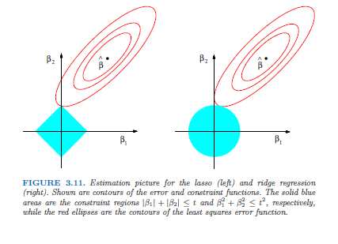

## Ridge Regression

We consider a linear model
$$ y_i = \sum_{k=1}^p x_{ik} \beta_k + \varepsilon_i = x_i' \beta + \varepsilon$$
The OLS solution is given by:  
$$ \hat{\beta}_{OLS} = (X'X)^{-1} X'y $$
The ridge estimator is given by
$$ \hat{\beta}_{ridge} = (X'X+ \lambda I_p)^{-1} X'y $$
We inflate the $X'X$ matrix by $\lambda I_p$ so that it is positive definite
irrespective of $p$, including $p > n$.

## Ridge Regression | Expectation

$$ \mathbb{E}[\hat{\beta}(\lambda)] = \mathbb{E}[(X'X+ \lambda I_p)^{-1}X'Y]= X'X(\lambda I_p + X'X)^{-1} \beta $$
  Clearly, $\mathbb{E}[\hat{\beta}(\lambda)] \neq \beta$ for any $\lambda >0$. 

$$ \lim_{\lambda \rightarrow \infty} \mathbb{E}[\hat{\beta}(\lambda)] = 0_p $$
  
Hence, all regression coefficients are shrunken towards zero as the penalty increases.

## Ridge Regression | Expectation | Orthogonal Design

Orthogonal design: $X'X=I_p$

$$\hat{\beta}(\lambda) = (1+\lambda)^{-1} \hat{\beta}$$

+ Ridge estimator scales the OLS estimator by a fixed factor.

## Ridge Regression | Variance

Define $W_{\lambda}=[\lambda I_p + (X'X)^{-1}]^{-1}$. Hence,

$W_{\lambda} \hat{\beta}= \hat{\beta}(\lambda).$
  
$$ \mathbb{Var}[\hat{\beta}(\lambda)] = \sigma^2 W_{\lambda} X'X W_{\lambda}' $$
    
$$ \lim_{\lambda \rightarrow \infty} \mathbb{Var} [\hat{\beta}(\lambda)] = 0_p$$
      
It can be shown that $\mathbb{Var}[\hat{\beta}] \geq \mathbb{Var}[\hat{\beta}(\lambda)]$
      
## Ridge Regression | Variance | Orthogonal Design
      
$\mathbb{Var}[\hat{\beta}(\lambda)]=\sigma^2(1+ \lambda)^{-2}I_p$
        
The variance of the OLS estimator exceeds the variance of the Ridge estimator.
      
## Ridge Regression | Mean Squared Error (MSE)
      
$MSE(\hat{\theta})= \mathbb{E}[(\hat{\theta} - \theta)^2] = \mathbb{Var}(\hat{\theta}) + [Bias(\hat{\theta})]^2$
        
$MSE(\hat{\beta}(\lambda))= \sigma^2 tr\{W_{\lambda}(X'X)^{-1} W_{\lambda}'\}$
          
$+ \beta'(W_{\lambda}-I_p)'(W_{\lambda}-I_p) \beta.$
          
**Theorem** (Theobald, 1974)  
        
There exists $\lambda > 0$ such that $MSE[\hat{\beta}(\lambda)]<MSE[\hat{\beta}(0)]= MSE[\hat{\beta}]$

## Ridge Regression | Constrained Optimization
          
The Ridge estimator minimizes the ridge loss function which is defined as
        
$$ \mathcal{L}_{ridge}(\beta, \lambda) = ||Y-X\beta||^2_2 + \lambda ||\beta||_2^2 $$
          
with $||\beta||_2^2= \sum_{j=1}^p \beta_j^2$
          
$$\frac{\partial}{\partial \beta}  \mathcal{L}_{ridge}(\beta, \lambda) = - 2X'Y + 2(X'X + \lambda I_p) \beta = 0$$
            
Solving for $\beta$ yields the ridge estimator.
The Hessian is semi-positive definite matrix and hence the ridge estimator is a minimum of the constrained optimization problem.
          
## Ridge Regression | Constrained Optimization
          
This minimization problem can be reformulated as the following constrained optimization problem
          
$$\hat{\beta}(\lambda) = \arg \min_{||\beta||^2_2 \leq c} ||Y-X\beta||^2_2$$
            
for some $c >0$.
          
## Ridge Regression | Bayesian Interpretation
          
*Bayesian Interpretation*: If the prior distribution
for $\beta$ is $N(0, \tau^2 I_p)$, and the distribution of $\varepsilon_i$ is normal $N(0, \sigma^2)$, if $\lambda = \sigma^2/\tau^2$, then $\hat{\beta}_{ridge}$ is the posterior mean/mode/median.

## Lasso Regression | Introduction
          
Linear model: $y_i=\sum_{j=1}^p \beta_j X_i^{(j)} + \varepsilon_i, i=1,\ldots,n$, 
$\varepsilon_i,\ldots, \varepsilon_n$ i.i.d., independent of $\{X_i, i=1,\ldots,n\}$ and $\mathbb{E} [\varepsilon_i]=0$ and $\mathbb{V} [\varepsilon_i]=\sigma^2$  
            
Wlog: intercept is zero and covariates are centered and on the same (unit) scale.  
          
Now: $p \gg n$
            
Problem: ols estimator not unique and overfit of the data
          
## Lasso Regression
          
The Lasso estimator is given by
$$ \hat{\beta}(\lambda)=\arg \min_{\beta \in \mathbb{R}^p} \left(||Y-X\beta||_2^2/n + \lambda ||\beta||_1 \right) (*) $$
            
$||Y-X\beta||_2^2=\sum_{i=1}^n (Y_i - (X\beta)_i)^2$, $|| \beta||_1 = \sum_{j=1}^p |\beta_j|$, $\lambda \geq 0$ penalization parameter
          
## Lasso Regression
          
$(*)$ is equivalent to
          
$$ \hat{\beta}_{primal}(R) = \arg \min_{\beta \in \mathbb{R}^p}  \left(||Y-X\beta||_2^2/n \right) $$
such that $||\beta||_1 \leq R$ with a one-to-one relation between $R$ and $\lambda$.
          
This optimization problem is a convex problem (and hence efficient computation is possible. ) 
          
## Comparison Lasso and Ridge Regression
          

          
## Computation of the Lasso Solution | Single Predictor
$$ \min_{\beta} \{1/(2N) \sum_{i=1}^n (y_i - z_i \beta)^2 + \lambda |\beta|\} $$
            
The solution is given by
          
$$ \hat{\beta} = \left\{\begin{array}{cl} 1/n \langle z,y \rangle - \lambda  & \mbox{if}\quad 1/n   \langle z,y \rangle > \lambda\\
            0 &  \mbox{if}\quad 1/n |\langle z,y \rangle | \leq \lambda\\
            1/n \langle z,y \rangle + \lambda  & \mbox{if}\quad 1/n \langle z,y \rangle < - \lambda
            \end{array}\right.$$
              
## Computation of the Lasso Solution | Single Predictor
This can be written as
$$ \hat{\beta} = \mathcal{S}_{\lambda}(1/N <z,y>)$$
with the *soft-threshodling* operator
            
$$ \mathcal{S}_{\lambda}(x)=sign(x)(|x|-\lambda)_+$$
              
## Computation of the Lasso Solution | Multiple Predictors
              
cyclical coordinate descent
            
$$ \frac{1}{2n} \sum_i (y_i - \sum_{k \neq j} x_{ik}\beta_k - x_{ij} \beta_k)^2 + \lambda \sum_{k \neq j}|\beta_k| + \lambda |\beta_j|$$
              
              Idea: we repeatedly cycle through the predictors in some fixed order, where at the $j$th step, we update the coefficient $\beta_j$ by minimizing the objective function in this coordinate while holding fixed all other coefficients at their current values.
            
## Computation of the Lasso Solution | Multiple Predictors
            
With partial residuals $r_i^{(j)}= y_i - \sum_{k \neq j} x_{ik} \hat{\beta}_k$
              
$$ \hat{\beta}_j=\mathcal{S}_{\lambda}(\frac{1}{n}\langle x_j, r^{(j)}\rangle) $$
              
The overall algorithm operates by applying this soft-thresholding update repeatedly in a cyclical manner, updating the coordinates of $\hat{\beta}$ along the way.   